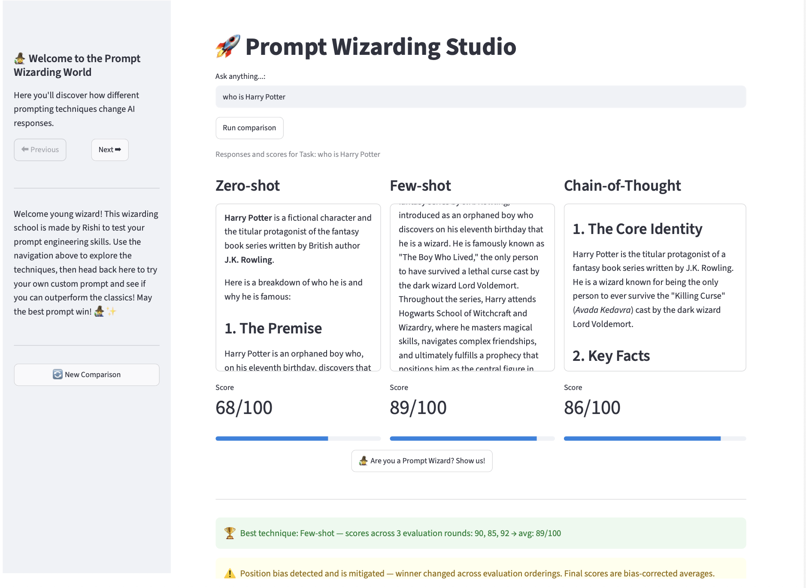

# 🧙 Prompt Wizarding World

> *Where prompts are spells, and the best wizard wins.*

Welcome to **Prompt Wizarding World** — an interactive playground that puts the three classic prompt engineering techniques (Zero-shot, Few-shot, and Chain-of-Thought) head-to-head on any task you throw at them, scores their responses with an LLM judge, and then dares **you** to write a prompt good enough to beat all three.

This isn't just a demo. It's a hands-on way to *see* prompt engineering work — and to test whether you've actually learned it.
---
### LIVE DEMO LINK
### 🔗 [Try it live](https://promptwizardingstudio.streamlit.app) 



---

## ✨ What it does

1. **You ask a question** — anything from "explain photosynthesis" to "solve this equation."
2. **The task gets classified** automatically into a category (factual, classification, creative, reasoning, or summarization), so the few-shot examples shown to the model actually match the task type.
3. **Three techniques compete**, each generating an answer to the exact same question:
   - 🎯 **Zero-shot** — no help, no examples, just the raw question.
   - 📚 **Few-shot** — shown relevant example answers first, to learn the pattern.
   - 🧠 **Chain-of-Thought** — explicitly asked to reason step by step before concluding.
4. **An LLM judge scores all three** out of 100 on relevance, completeness, appropriate length, and clarity — then picks a winner and explains why.
5. **🧙 The Prompt Wizard Challenge** — write your *own* full prompt for the same task, and the judge scores it against all three techniques. Beat all three and earn the title of **Prompt Wizard**.

---

## 🏆 Why this is more than a side-by-side comparison

Most prompt comparison demos just show three answers and call it a day. This one goes further:

- **Dynamic few-shot examples** — the model doesn't always see the same two generic examples. A classification step detects the task type first, so few-shot gets genuinely relevant demonstrations.
- **A judge that actually differentiates** — built and iterated specifically to avoid score inflation (no more "100/100/100" for everything), penalize unnecessary length, and reward concise answers when concise is correct.
- **Position-bias mitigation** — the judge is explicitly instructed not to favor a response just because of where it appears in the prompt.
- **Weak-model testing** — response generation runs on a deliberately lighter model (`gemini-2.5-flash-lite`), so the *techniques themselves* — not raw model power — are what's actually being tested. The judge and classifier stay on a stronger model for reliable evaluation.
- **Retry logic** — API calls automatically retry on transient failures instead of crashing your run.

---

## 🛠️ Tech Stack

- **Streamlit** — the web interface
- **Google Gemini API** (`google-genai`) — response generation, classification, and judging
- **Pydantic** — structured, schema-enforced JSON outputs (no fragile text parsing)
- **python-dotenv** — environment-based API key management

---

## 📦 Installation

### 1. Clone the repository

```bash
git clone https://github.com/rishidakshbansal2004-create/PromptWizardingStudio.git
cd PromptWizardingStudio
```

### 2. Create a virtual environment (recommended)

```bash
python -m venv venv
source venv/bin/activate   # On Windows: venv\Scripts\activate
```

### 3. Install dependencies

```bash
pip install -r requirements.txt
```

### 4. Set up your API keys

This project uses the **free tier** of the Gemini API — no billing required.

1. Get a free API key from [Google AI Studio](https://aistudio.google.com).
2. Create a `.env` file in the project root with the following:

```env
Res_Gem_Api_Key=your_first_api_key_here
Gem_Api_Key=your_second_api_key_here
```

> 💡 Two keys are used to split API calls across the response-generation and judging stages, helping stay comfortably within free-tier rate limits. You can use the same key twice if you prefer — the app will still work.

### 5. Run the app

```bash
streamlit run app.py
```

Your browser should open automatically to `http://localhost:8501`. If it doesn't, copy that URL manually into your browser.

---

## 🎮 How to use it

1. Type any question or task into the input box and click **Run comparison**.
2. Watch the three techniques generate their answers, get scored, and see which one the judge crowns the winner.
3. Feeling confident? Click **🧙 Are you a Prompt Wizard? Show us!**, write your own full prompt for the same task, and submit it.
4. See how your prompt stacks up against all three techniques — and find out if you've earned the title of **Prompt Wizard**.
5. Click **🔄 New Comparison** to start fresh with a new task.

---

## 📁 Project Structure

```
prompt-wizarding-world/
├── app.py            # Streamlit app — UI, state management, API orchestration
├── prompt.py         # All prompt-building functions (zero-shot, few-shot, CoT, judge, classifier)
├── requirements.txt  # Python dependencies
├── .env               # Your API keys (not committed to git)
└── README.md
```

---

## 🔮 What I learned building this

- How prompting technique interacts with model strength — few-shot and Chain-of-Thought show clearer advantages on a *weaker* model, while a strong model often performs well even with zero guidance.
- LLM-as-judge systems are prone to real, documented biases — score inflation and positional bias — and need explicit, deliberate prompt design to counter them.
- Few-shot examples don't just teach *content*, they teach *length and style* — generic short examples can accidentally make every few-shot answer artificially terse, regardless of what the task actually needs.
- Structured output (via schema-enforced JSON) is far more reliable than asking a model to "please respond in JSON" — and far easier to build on top of.

---

## 🚧 Future ideas

- Let users choose which model powers each technique, to directly compare technique effectiveness across model strength.
- Add a history/leaderboard of past prompt attempts.
- Expand beyond three techniques — self-consistency, role-prompting, and few-shot CoT hybrids are natural next additions.

---

Built with curiosity, a lot of debugging, and zero shortcuts — by Rishi.

*May the best prompt win.* 🧙‍♂️✨
